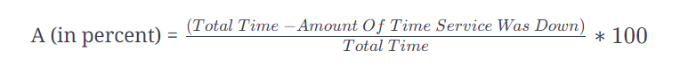
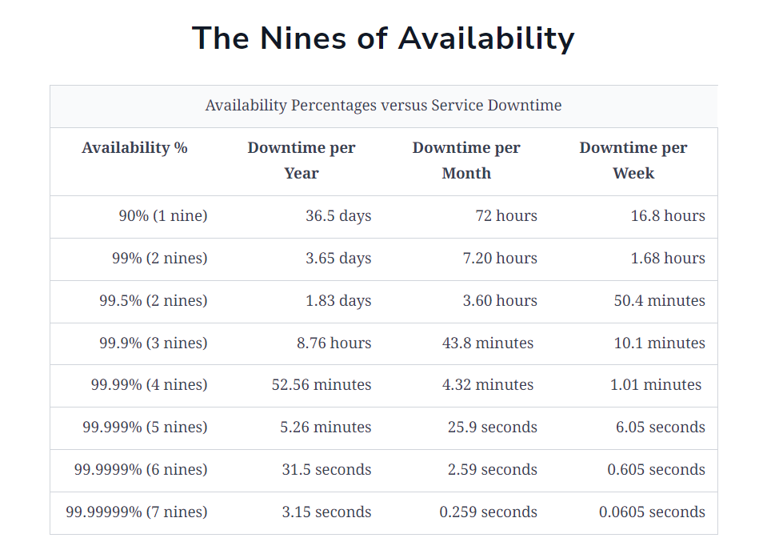

## Availability

### What is Availability?
Availability is a present of time the System or Infrastructure is available to the client in normal conditions. 
100% availability means a System or Infrastructure functions and respondes all the time in normal conditions.

Availability **‘A’** is a ratio. We can measure Availability with the below equation.

### We measure availability as a number of nines.

