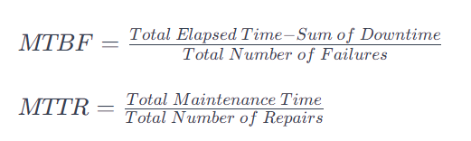

## Reliability

### What is Reliability?
Reliability means consistency delivering response and performing the task even in the presence of faults and failures.

#### Reliability measured with below equations
1. Meantime between failures - MTBF
2. Meantime to repair - MTTR

