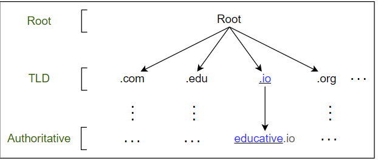
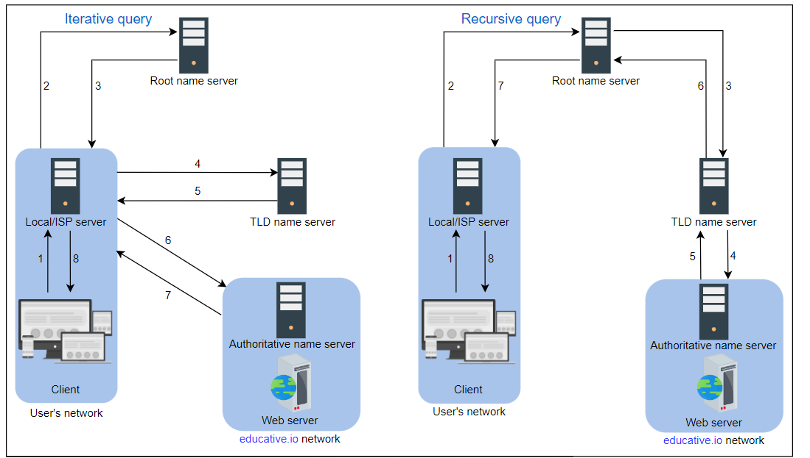

## Domain Name System

### What is a Domain System?
Every system which is connected to the network has an IP address. If you want to access any resource from a particular 
server you need the IP address of that server.

Remembering the IP address of the servers is not an easy job for humans that is why we created domain names. Domain 
names are mapped to specific IP addresses. Domain names are human readable and easy to remember.

We have Domain names which are mapped to a specific IP address. How is going to maintain this mapping? How to get the 
IP address of specific Domain? DNS does all of this for you.

#### DNS
DNS stands for Domain Name system. DNS responsible for storing the Domain mapping and you can also get the IP address 
of a domain from DNS.

When a user requests a Domain form the Browser. Browser requests DNS to provide IP address of that Domain name. Once a 
List of IP addresses is received to the browser then the browser makes a request to the server using anyone of the IP 
which is received from the browser.

#### Important Details of DNS.
**Name servers** 
1. DNS is not a single system which is a complex system of multiple small components. Users can query the 
Name server to get the details of the particular domain.

**Resource Record**
1. DNS store the Domain and mapping in the form of Resource Record (RR). There are multiple types of Resource Record.

### DNS Hierarchy
#### There are mainly four types of servers in DNS Hierarchy
#### DNS resolver
1. Which is present inside the client network. If the result of the DNS query cached in this server it will return the 
IP or else. DNS resolver initiates the DNS query.

#### Root-level name server
1. Root level name server returns the list of Top level this can provide the IP address of a given main domain. If i 
give www.google.com. This server returns the list of top level name server IPs which can provide the IP address of 
domain name .com. Since the main domain of the given domain name is .com.
#### Top-level name server 
This server returns the list of Authoritative name servers of the given domain organisation.
#### Authoritative name server
This server return the List of IP address if the given domain name query.

There are two ways to perform a DNS query:

**Iterative:** 
1. The local server requests the root, TLD, and the authoritative servers for the IP address.

**Recursive:** 
1. The end user requests the local server. The local server further requests the root DNS name servers. The root name servers forward the requests to other name servers.

