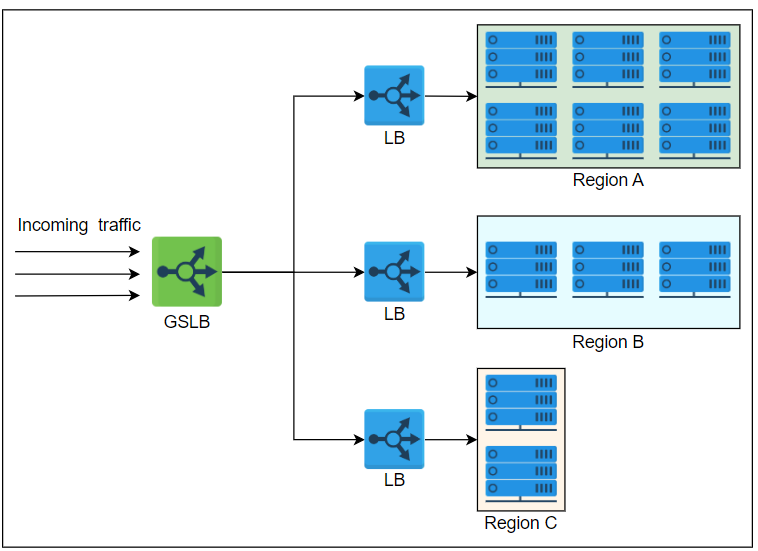

## Load Balancing

### What is Load Balancing?
In Distributed systems multiple services are working together as a same system. We may receive thousands of requests 
every sec, even more than that. If you have a single system for each component we can not serve every client request 
so to overcome this issue we need to scale out the components. After adding more servers we need to handle or route the 
traffic to the system. To do that we need a system that is also known as Load Balancing server.

### Load Balancing
Load Balancing is a component is a Distributed system which accepts the request form end-user and divides the traffic or
route the request to the end-servers based on the custom algorithm. Load Balancers are the first contact of any request.

### Load balancers provides the following capabilities:
#### Scalability
When you add or remove new services you no need to provide the end server IP to the end users. If a request comes to the
LB. LB can redirect to the end servers. Based on the load LB can add or remove the serves.
#### Availability 
If any faults or failures happen. If any service down load balancer can redirect the request to healthy servers so the 
end user may not face any unavailability of the system.
#### Performance 
Load Balancers can identify the overloaded servers and can forward the traffic to the systems which are not overloaded 
to improve the performance of the request.  

## Global and Local Load Balancing

#### Global Load Balancing 
Global load balancers distribute the traffic over multiple geographical locations. When a request is accepted by Global 
Load balancer then it will search for the nearest geographical location to route the request.
#### Local Load Balancing 
We need local load balancing in every data center to utilize the resources and distribute the traffic to the server effectively.

#### DNS Loading balancing
DNS servers also act as global load balancers. When a user requests the IP address of a Domain. DNS system returns a 
list of IP addresses of the servers which are near to the user location. Request packet of DNS  is very small and we 
can not send all required info to DNS to manage traffic effectively.

