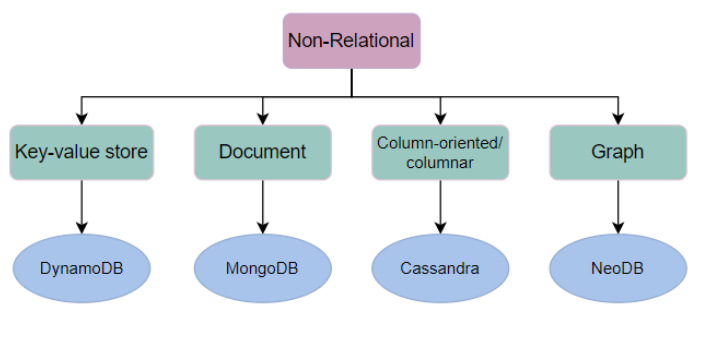
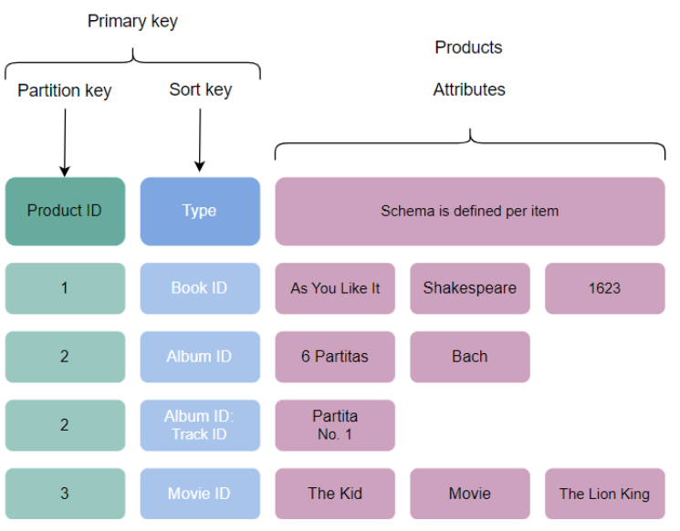
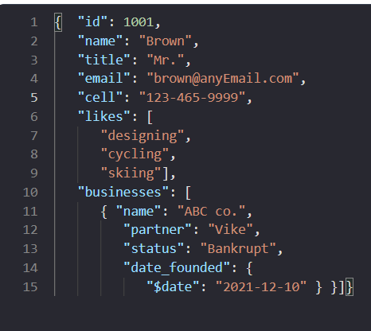

## Type of Databases
There are two types of databases
1. Relational Databases
2. Non Relational Databases (NoSQL)

### What is Relational Databases?
Database is an organized collection of data. Relational databases store data in tabular format. Each column represents 
the property of the Entity. Each row represents an entity.

In a table a row can be distinguished  by a primary key. We can logically create relations between two tables by 
storing the primary key of a row in row of the other table. It is nothing but a foreign key.

### Relational databases support ACID properties.
#### Atomicity:
We can create a set of operations as a transaction. Atomicity is nothing but a transaction should be an atomic unit. 
All operations in a transaction should pass or else all should be failed. Partial execution is not allowed in atomicity.
#### Consistency:
In any given time the database should be in a consistent state.Even concurrent writes and reads happening the database 
should return the same value for the same query at a given time.
#### Isolation:
Transactions should be isolated. Even when we execute the two transactions parallelly the result of the execution should
be the same as you execute the transaction sequentially.  
#### Durability:
The system should be fault tolerant. Even in the failures any write is committed to the database the results should be 
persistent in the Database.

### Advantages of Relational Databases
#### Flexibility
Relational databases offer flexibility to manipulate the data by providing support for query language. All relational 
databases are standardized so we can easily migrate from one relational database to another relational database.

#### Data Redundancy
We can perform the normalization to eliminate the redundant data. We can create relationships between two tables using 
foreign keys to eliminate duplication of data.

#### Consistency
Relational databases provide high consistency. It has a schema for every table.Using ACID properties relational 
databases transactional management very efficiently.

Disaster recovery:
We can create database mirrors to replicate the data. So if any loss of data we can recover it from the mirror database.

### Disadvantages of Relational Databases
#### Impedance mismatch
Now Application servers store the data in the form of complex structures. We can not store the same structure in the 
relational databases. We need to extract the data from the complex structure, to store it in the Database.

## Why Non Relational DataBases?
Non Relational databases can store semi structured or unstructured data. It can handle large amounts of data with 
low latency and high write/read of the data by compromising some of  the consistency constraints.

### Advantages of NoSQL Databases.
#### Availability
NoSQL databases provide high availability. By replicating the same data in multiple nodes. By compromising some of the 
consistency constraints.

#### Scalability:
By nature NoSQL databases can handle high write/read operations. By using replication and partition it can provide 
high Scalability.

### Handle Unstructured and Semi-structured data

### Disadvantages of NoSQL Databases.
#### Consistency:
NoSQL provided various database modules based on the requirements by trade offs between consistency and availability. 
NoSQL databases are not strong consistency models; they provide eventual consistency.
#### Data Migration:
NoSQL doesn't have any standardization so migration data between different NoSQL database modes is very difficult.

### Types of Non Relational Databases
1. Key-Value store
2. Document
3. Column oriented
4. Graph

### Key-Value store:
In Key-Value store the data stored in the form of key-value. Databases use a hash function on the key to get the unique 
hash code for the given key using the reference of the hash code the data can be manipulated. This is referred to as a unique or primary key. Key can be a simple value or it can be a combination of one or more fields.

#### Use Case:
To store session information of a particular session we use this type of database. We can store recommendations, user 
information ect. DynamoDB is a key-value store database.

### Document
Document type databases store data as Document and Data stored in the document as collections. MongoDB is a Document 
type database. These databases store data as JSON, BSON or XML format. This stores the compressed data of hierarchical data.

#### Use Case:
We are developing an e-commerce website. We have to build the catalog and each item in the catalog may have its own 
properties which can be nested also. In this case we can use Document type databases.

### Column-Based
Column based databases store the data in columns instead of rows. Which gives quicker access to the attributes. 
Casandra is a Column Based database.

### Graph
Graph databases store the data in graph data structure. Each node in the graph represents an entity and each edge 
represents the relation between entities.

#### Use Case:
Social media networking applications use graph databases to store the connections between the user.
