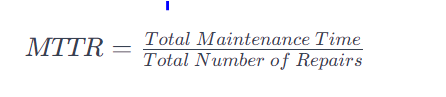

## Maintainability
### What is Maintainability.
Once the system is built. We need to keep it running smoothly in production. In this process we may face lots of 
failures, faults, bugs and integrating new features. Maintainability is nothing but how easily we can fix bugs are 
integrate new features without affecting the downtime of the system or in minimal downtime.

#### We can divided Maintainability into three categories;
**Operability :** 
    
    How easily the system can be repaired or bring back to the normal state, If any failures happen to the system.
**Lucidity :** 

    It is how easily the code can be understated. The simplicity of the code base.
**Modifiability :** 

    How easily we can modify the code base. Integrate the new features or fixing the bugs.

#### Maintainability measured with Meantime to repair 
