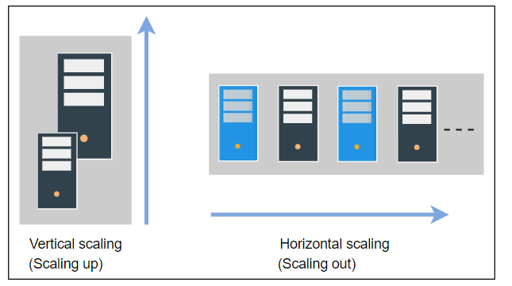

## Scalability

## What is Scalability?
Scalability is how a system can handle an increasing number of users, resources or workload without compromising the 
performance of the system.

### There are two type of workload
1. **Request workload** - This is nothing but the number of requests that can be handled by a system.
2. **Storage/Data workload** - This is nothing but the amount of data stored by a system.

### Dimensions
1. **Size scalability** - This is nothing but increasing the number of users and resources.
2. **Administrative scalability** - This is nothing but increasing the organisations and users the distributed system can handle.
3. **Geographical scalability** - This is nothing but how easily the system can serve or reach to the regions.

### Here are the different ways to implement scalability.
#### Vertical Scaling
    Vertical scaling is nothing but increasing the capacity of RAM, CUP, ect of the current system. This is also called 
    Scaling up. Scaling up is very expensive and it has hardware limitations.
#### Horizontal Scaling
    Horizontal Scaling is also called Scaling Out. Scaling out means adding small systems together to provide service 
    to the users without compromising the performance. It is a complex process because we need to design and implement 
    a system that can collaborate with other node to work as a single system.

